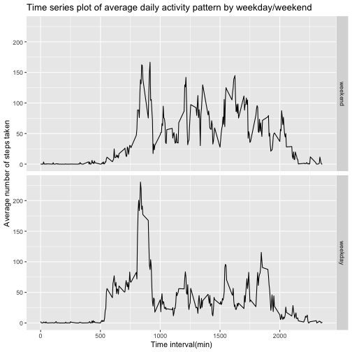

We will first load our activity dataset and relevant packages

```r
activity <- read.csv("activity.csv")
library(ggplot2)
library(dplyr)
```

```
## 
## Attaching package: 'dplyr'
```

```
## The following objects are masked from 'package:stats':
## 
##     filter, lag
```

```
## The following objects are masked from 'package:base':
## 
##     intersect, setdiff, setequal, union
```

transform the date column into class date

```r
dates <- as.Date(activity$date, "%Y-%m-%d")
activity$date <- dates
```

aggregate steps based on date
plot histogram of total steps per day
report mean and median of total steps per day 
remove missing values for these calculations

```r
agg <- aggregate(activity$steps, by = list(activity$date), sum, na.rm = TRUE,
                 na.action = NULL)
hist(agg$x, col = "lightblue", xlab = "Total number of steps taken per day", 
     main = "Histogram of total number of steps taken per day", labels = TRUE)
```


```r
mean(agg$x, na.rm = TRUE)
```

```
## [1] 9354.23
```

```r
median(agg$x, na.rm = TRUE)
```

```
## [1] 10395
```

aggregate steps based on interval
remove missing values 
plot time series plot of average daily steps 
output the 5-min interval with the highest average daily number of steps 

```r
agg_interval <- aggregate(activity$steps, by = list(activity$interval), mean, 
                          na.rm = TRUE, na.action=NULL)
plot(agg_interval$Group.1, agg_interval$x, type = "l", 
     main = "Time series plot of average daily activity pattern", 
     xlab = "Time interval(min)", 
     ylab = "Average number of steps taken", col = "lightblue")
```


```r
agg_interval$Group.1[which.max(agg_interval$x)] #the 5-min interval with the highest average daily number of steps
```

```
## [1] 835
```

calculate and report the total number of missing values in the dataset
Strategy: impute missing values with average of that interval across all days
    this is done with the for loop
the dataset "act" returned by this for loop has all the missing values imputed

report the mean and median of the avg total number of steps per day 
after imputation

both the mean and median changed after imputing the missing values
the mean changed from 9354.23 to 10766.19
the median after imputation is equal to the mean (10766.19), it was originally
10395

```r
sum(is.na(activity$steps)) #total number of missing values in the dataset
```

```
## [1] 2304
```

```r
na_in <- which(is.na(activity$steps)) #get NA value indices
act <- activity #replicate the data frame
for (i in na_in) {
    act$steps[i] <- agg_interval$x[which(agg_interval$Group.1 == act$interval[i])]
}

agg_na_imputed <- aggregate(act$steps, by = list(act$date), sum)
hist(agg_na_imputed$x, col = "lightgreen", 
     xlab = "Total number of steps taken per day", 
     main = "Histogram of total number of steps taken per day after imputation", 
     labels = TRUE)
```


```r
mean(agg_na_imputed$x)
```

```
## [1] 10766.19
```

```r
median(agg_na_imputed$x)
```

```
## [1] 10766.19
```

Get the day of the week from the date column of the dataset
add a column to the dataset -- a factor variable indicating whether a date is
weekday or weekend
group by interval and weekday variables using group_by function from dplyr package
get mean steps for each group with summarize function

make time series panel plot with qplot function of the ggplot2 system

```r
weekday <- weekdays(act$date)
weekdays <- c("Monday", "Tuesday", "Wednesday", "Thursday", "Friday")
weekday <- factor((weekday %in% weekdays), levels=c(FALSE, TRUE), labels=c('weekend', 'weekday'))

act <- cbind(act, weekday)

grouped <- group_by(act, interval, weekday)
summ <- summarize(grouped, mean = mean(steps))
```

```
## `summarise()` regrouping output by 'interval' (override with `.groups` argument)
```

```r
qplot(interval, mean, data = summ, geom = "line", facets = weekday~., 
      xlab = "Time interval(min)", ylab = "Average number of steps taken", 
      main = "Time series plot of average daily activity pattern by weekday/weekend")
```


